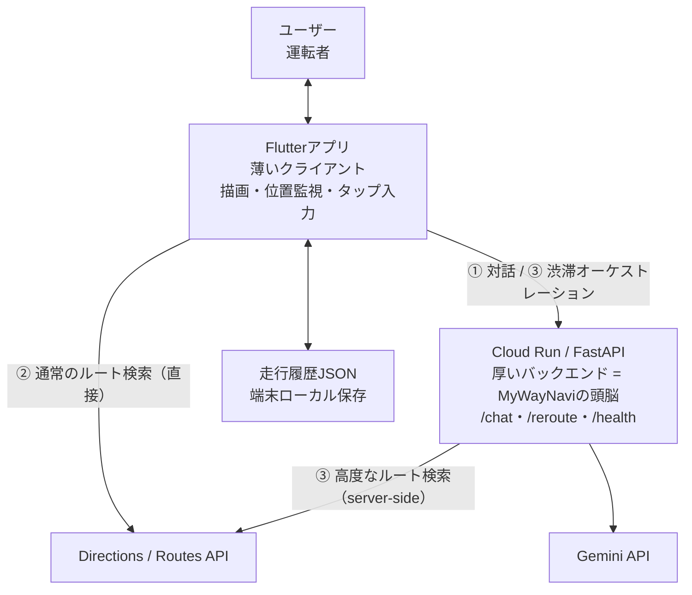
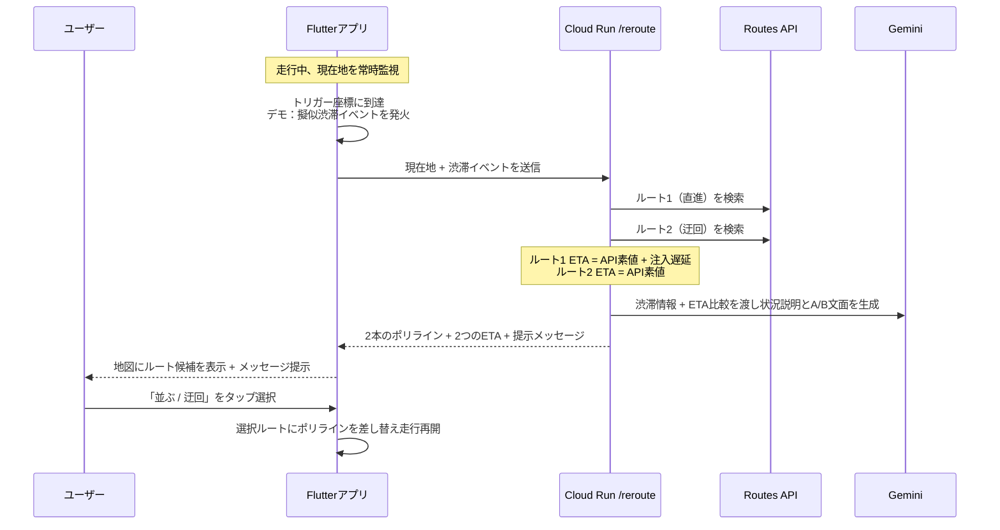

# MyWayNavi 技術仕様書

**ナビじゃない、ドライビングパートナー**

バージョン：v0.2
作成日：2026-06-28（v0.1：2026-05-20）
作成者：tukazou

---

## 変更履歴

| 版 | 日付 | 主な変更 |
|---|---|---|
| v0.1 | 2026-05-20 | 初版（HTML/JS フロント＋FastAPI バックエンド前提） |
| v0.2 | 2026-06-28 | 実装構成を反映。フロントを **Flutter** に変更。アーキテクチャを「**薄いクライアント／厚いバックエンド**」に整理。外部連携を非対称な3経路として定義。渋滞オーケストレーション（`/reroute`）を新規設計。地図ルートを Directions API → **Routes API** へ移行する方針を明記。 |

> 本書は「実装済みの現状」と「これから実装する目標構成」を併記する。各所に **【現状】／【目標】** を付す。

---

## 1. システム概要

### 1.1 設計方針 ― 薄いクライアント／厚いバックエンド

MyWayNavi の「気の効かせ方」（迂回戦略・状況説明・ETA比較）は **ビジネスロジック** であり、これを Cloud Run 側に集約する。Flutter アプリは描画・位置監視・入力に専念する薄いクライアントとする。

- **Flutterアプリ（クライアント）**：地図/マーカー/ポリラインの描画、走行中の現在地監視とトリガー判定（デモ）／GPS追従（本番）、ユーザーのタップ取得。**業務ロジックは持たない。**
- **Cloud Run（FastAPI／バックエンド）**：システムプロンプト、迂回戦略、遅延注入、ETA組み立て、Gemini呼び出し。**MyWayNaviの頭脳。**

### 1.2 外部連携は「非対称な3経路」

通常のルート検索まで Cloud Run に通すと遅く・脆くなるため、**通常系はクライアント直、頭脳が要る高度系だけバックエンド集約** という非対称構成を取る。

| 経路 | 内容 | 通り道 |
|---|---|---|
| ① 対話 | 目的地入力・チャット応答 | Flutter → Cloud Run `/chat` → Gemini |
| ② 通常のルート検索 | 普段の目的地→2案提示 | Flutter → Directions/Routes API（**直接**、Cloud Run を通らない） |
| ③ 高度なルート検索 | 渋滞検知→迂回オーケストレーション | Flutter → Cloud Run `/reroute` → Routes API ＋ Gemini |

### 1.3 全体構成図



### 1.4 技術スタック

| レイヤー | 技術 | 備考 |
|---|---|---|
| フロントエンド | **Flutter（Dart）** | v0.1 の HTML/JS から変更 |
| 地図表示 | Google Maps SDK for Flutter | 現在地・ポリライン描画 |
| バックエンド | Python + FastAPI | Cloud Run 上 |
| AI | Gemini API | Cloud Run 経由。**現状 `gemini-3.1-flash-lite`（暫定）**、`gemini-3.5-flash` 復帰が宿題（Issue #1） |
| ルート計算 | Directions API → **Routes API（computeRoutes）** | 移行予定。迂回検索は server-side |
| デプロイ | Cloud Run（asia-northeast1） | `/chat`・`/health` は稼働中 |
| CI/CD | GitHub Actions → Cloud Run | **YAMLはあるが Secrets/認証未設定（未実動）** |
| データ保存 | ローカルJSON | 端末保存・サーバー非送信 |

---

## 2. 画面設計

| 画面 | 説明 |
|---|---|
| 地図表示画面 | 現在位置・走行ルートをリアルタイム表示するメイン画面 |
| ルート選択画面 | 目的地までの全体図と複数ルート（色分け）・所要時間/距離/料金を比較表示 |
| チャットパネル | **地図下半分にオーバーレイ**。ユーザー/AIの吹き出し、ローディング表示、自動スクロール。将来は音声入出力（STT/TTS）に置き換え |

ルート選択画面では、ユーザーがルートを選び「案内開始」を明示的に押すまでナビは始まらない（デモの自動起動防止）。

---

## 3. APIエンドポイント設計

### 3.0 役割分担

| 機能 | 実行場所 | 備考 |
|---|---|---|
| 対話（`/chat`） | Cloud Run | システムプロンプトは server 集約 |
| 渋滞オーケストレーション（`/reroute`） | Cloud Run | **本書の中核。第4章で詳述** |
| ヘルスチェック（`/health`） | Cloud Run | 稼働確認 |
| 通常のルート検索 | **クライアント直** | Directions/Routes API を Flutter から直接 |
| 走行履歴 | **端末ローカルJSON** | サーバーへ送らない（プライバシー） |

### 3.1 `/chat` ― 会話エンドポイント【現状稼働】

**メソッド**：POST

**リクエスト**
```json
{
  "message": "今日は、Movix柏の葉までのルートを出して",
  "context": {
    "current_location": { "lat": 35.6481, "lng": 140.0468 },
    "user_profile": {
      "vehicle_width": 1840,
      "preferred_roads": ["広い道", "慣れた道"]
    }
  },
  "conversation_history": []
}
```

**レスポンス**
```json
{
  "reply": "映画館ですね。作品の上映時刻は何時ですか？",
  "action": null
}
```

`action` の種類：`null`（返答のみ）／`"show_routes"`／`"start_navigation"`／`"show_reroute"`。

### 3.2 `/reroute` ― 渋滞オーケストレーション【新規・目標】

渋滞イベントを受けて、**ルート1（直進）とルート2（迂回）の検索・ETA組み立て・Gemini文面生成をサーバー側で一括実行**する。クライアントは結果を描画・提示するだけ。

**メソッド**：POST

**リクエスト**
```json
{
  "current_location": { "lat": 35.776511, "lng": 139.888695 },
  "destination": "Movix柏の葉",
  "congestion_event": {
    "id": "misato_jct",
    "location_label": "三郷JCT合流部（三郷IC付近）",
    "length_km": 2.0,
    "injected_delay_min": 20,
    "note": "伸びる可能性あり"
  },
  "conversation_history": []
}
```

**レスポンス**
```json
{
  "reply": "この先、三郷JCTの合流で約2km・20分ほどの渋滞があり、伸びそうです。このまま並ぶか、三郷中央ICで降りて下道で迂回するか。迂回すると到着は10分ほど遅くなりますが、停まらずスムーズに行けます。どうしますか？",
  "action": "show_reroute",
  "routes": [
    {
      "id": "route_stay",
      "label": "並ぶ（このまま常磐道）",
      "polyline": "<encoded>",
      "eta_min": 55,
      "eta_breakdown": { "api_static_min": 35, "injected_delay_min": 20 }
    },
    {
      "id": "route_detour",
      "label": "迂回（三郷中央IC→三郷流山橋→流山IC）",
      "polyline": "<encoded>",
      "eta_min": 45,
      "eta_breakdown": { "api_static_min": 45, "injected_delay_min": 0 }
    }
  ],
  "source": "live"
}
```

`source`：`"live"`（Routes API成功）／`"fallback"`（キャッシュ/ハードコードで応答）。

### 3.3 `/health`【現状稼働】

`GET /health` → `{ "status": "ok" }`。Cloud Run 稼働確認用。

### 3.4 走行履歴【端末ローカル】

サーバーエンドポイントではなく、端末ローカルJSONとして読み書きする（第5章）。1件のデータ構造は v0.1 から不変。

```json
{
  "id": "trip_20260519_001",
  "departure_time": "2026-05-19T08:30:00+09:00",
  "arrival_time": "2026-05-19T09:12:00+09:00",
  "origin": "千葉市稲毛区",
  "destination": "Movix柏の葉",
  "route": {
    "highways": ["湾岸習志野IC", "東関東道E51", "高谷JCT", "東京外環道C3", "三郷JCT", "常磐道E6", "柏IC"],
    "local_roads": ["海浜大通り", "国道357号"]
  },
  "decisions": [
    { "type": "route_selection", "options_presented": ["route_a", "route_b"], "selected": "route_a", "reason": "未走行ルートへの不安" },
    { "type": "congestion_response", "options_presented": ["stay", "detour"], "selected": "detour", "reason": "渋滞待ちを避けたい" }
  ],
  "passengers": "family"
}
```

---

## 4. 渋滞オーケストレーション設計（Issue 5）

本書 v0.2 の中核。デモシナリオのステップ7〜9に対応する。

### 4.1 検知 ― デモは擬似化、本番はポーリング

Google のルートAPIは「MyWayNavi 用のデモ渋滞」を知らない。実トラフィックをポーリングしても、撮影当日に三郷JCTが混んでいる保証がなく、毎回値が変わるため **再現性が壊れる**。よってデモでは検知をスクリプト化する。

| | デモ実装 | 本番設計 |
|---|---|---|
| 検知方法 | 自動走行マーカーがトリガー座標を通過したら1回だけ発火 | 案内ルート上の実渋滞を定期ポーリング |
| 渋滞データ | 固定の `congestion_event`（注入） | リアルタイム渋滞API |

> 検知のスクリプト化は手抜きではなく、APIの素性に対する正しい割り切り。本番では検知ロジックだけを実渋滞ポーリングに差し替えればよい。

**トリガー座標**：`35.776511, 139.888695` 付近（外環道・三郷中央ICの手前）。マーカーがこの座標へ到達（許容半径つき）で発火。

### 4.2 ルート1／ルート2の定義

検知時の **現在地を起点（origin）** として2本を比較する。

- **ルート1（並ぶ／`route_stay`）**：いま案内中の常磐道ルートを現在地から引き直した残り行程。ETA ＝ **API素値 ＋ 注入遅延**。
- **ルート2（迂回／`route_detour`）**：三郷中央ICで降り、三郷流山橋で江戸川を渡り、流山ICで常磐道に再流入して柏ICへ。ETA ＝ **API素値**（渋滞遅延は乗らない）。

迂回が「ずっと下道」でなく **流山IC再流入** なのは、渋滞しているのが三郷JCT合流部だけで、流山ICはJCTのすぐ先（三郷料金所SIC〜流山IC間は約2km）だから。詰まっている合流部だけを外科手術的にショートカットして高速に戻すのが、最も「気が利く」迂回になる。

### 4.3 ETAの出し方 ― TRAFFIC_UNAWARE ＋ 遅延注入

再現性を最優先し、両ルートとも **`TRAFFIC_UNAWARE`（＝`duration` が `staticDuration` と同値、当日の実トラフィックに左右されない素の時間）** で取得する。その上で：

- ルート1：素値 ＋ `injected_delay_min`（例 +20分）
- ルート2：素値そのまま

これにより「並ぶ＝速い道だが渋滞で+20分／迂回＝少し遠回りだが素のまま」という比較が毎回同じ数字で出る。かつ **両ルートのポリラインと素の時間は本物のAPI結果**＝「迂回は実際にRoutesで再計算、スクリプトしているのは渋滞イベントだけ」という説明可能な構成になる。

### 4.4 迂回ルートの強制（waypoint）

Routes API は渋滞を知らないため、単純に検索すると最短＝三郷JCT直進を選び、三郷中央で降りない。よって迂回は **waypoint で強制** する。

- via 点を **三郷流山橋〜流山側のR沿い**（＝一度三郷中央で降りないと辿り着けない位置）に置く。
- これで「origin→via（三郷中央で降りて橋を渡る）」「via→柏（流山ICで乗り直す）」が自然に出る。
- 正確な座標は実レスポンスを見ながら調整する（API が旧・流山橋ルートを引く可能性もあり、要確認）。

### 4.5 フォールバック（デモ安定性）

迂回ルート（ルート2）は固定の演出ルートなので、Cloud Run側でポリラインをキャッシュ／ハードコードしておく。`/reroute` 内で Routes API が **エラー、または期待した三郷中央経由になっていない** 場合は即座にキャッシュで応答する（`source: "fallback"`）。これで「server-sideで実APIを叩くが、落ちたらキャッシュで返す」を実現し、集約のクリーンさとデモ安定性を両取りする。

> 通常のルート検索（②）はこのフォールバックの対象外。あくまで高度系（③）のみ。

### 4.6 シーケンス（検知の瞬間）



### 4.7 `[渋滞情報]` テンプレート（Gemini入力）

`/reroute` が Gemini に渡す構造化データ。**数値はGeminiに生成させず、注入値とAPI実値を渡して説明させる**。

```
[渋滞情報]
- 渋滞地点：三郷JCT合流部（三郷IC付近）
- 渋滞の長さ：約2km
- 通過予測：約20分、さらに伸びる可能性あり
- ルート1（並ぶ）：このまま常磐道。早いが三郷JCTの渋滞に停まる。到着 {route_stay_eta}
- ルート2（迂回）：三郷中央ICで降りて三郷流山橋経由、流山ICで再流入。到着 {route_detour_eta}（約+10分）だが停まらずスムーズ
```

---

## 5. データ設計

### 5.1 走行履歴の保存方針

- **保存場所**：ユーザーのローカル端末（プライバシー保護）
- **形式**：JSON
- **サーバーへの送信**：なし

### 5.2 ユーザープロファイル

```json
{
  "vehicle": { "type": "Mazda CX-8", "width_mm": 1840 },
  "preferences": {
    "avoid_narrow_roads": true,
    "preferred_road_types": ["wide", "familiar"],
    "congestion_tolerance": "low"
  },
  "learned_patterns": {
    "frequent_destinations": [],
    "preferred_highway_entries": [],
    "typical_departure_times": []
  }
}
```

---

## 6. Geminiエージェント設計

### 6.1 システムプロンプト

- **配置**：Cloud Run 側に集約（クライアントに持たせない）。git push → Cloud Run で改善をデプロイできる＝「まわす」の対象。
- **方針**：押しつけない／簡潔に話す／状況を解釈して伝える／**数値ルートデータを生成させず、渡した実データで説明させる**。

```
あなたはMyWayNaviというAIドライビングパートナーです。
ドライバーの好み・走行履歴・車種を理解し、先回りして行動します。

【基本姿勢】
- 押しつけない。最終判断は必ずドライバーに委ねる
- 簡潔に話す。運転中なので長い説明は避ける
- 状況を解釈して伝える（情報の羅列ではなく）
- ルートの数値（距離・時間・料金）は自分で作らず、渡された[ルート情報]/[渋滞情報]の値を使う

【ドライバーの情報】
- 車種：{vehicle_type}（全幅：{vehicle_width}mm）
- 好みのルート傾向：{route_preferences}
- 直近の走行履歴：{recent_trips}

【現在の状況】
- 現在地：{current_location}
- 目的地：{destination}
- 時刻：{current_time}
```

### 6.2 主要フロー

- **目的地入力時**：目的地の性質判断 → 履歴から好み参照 → 複数案を比較提示
- **渋滞検知時**：`/reroute` が ルート1/2 とETAを用意 → Geminiが状況説明＋A/B提示（第4章）
- **目的地近接時**：駐車場・入口を提示（例：ららぽーと柏の葉 P6）

---

## 7. Google Maps API 利用方針

### 7.1 Directions API → Routes API 移行

**【現状】** Directions API を Flutter から直接呼び出し。
**【目標】** Routes API（`computeRoutes`）へ移行。理由：`staticDuration` と `duration` が別フィールドで取れ、料金（`tollInfo`）も返るため、「素の時間＋注入遅延」「迂回の有料橋込み料金」を出すのに噛み合う。

> 注：レガシーのDirections APIは2025-03-01付でLegacyステータス。既存有効化済みなら継続利用可だが、現行後継はRoutes API。Issue 8（ドキュメント整合）と併せて移行する。

| 機能 | 使用API | 実行場所 |
|---|---|---|
| 通常のルート検索・比較 | Routes API（`computeRoutes`） | クライアント直 |
| 迂回ルート検索（`/reroute`） | Routes API（waypoint強制・`TRAFFIC_UNAWARE`） | server-side |
| 現在地表示 | Maps SDK for Flutter | クライアント |
| 目的地検索 | Places API | クライアント |

### 7.2 トラフィック設定

- 再現性のため、ルート1/2の素値は `routingPreference: TRAFFIC_UNAWARE` で取得（`duration == staticDuration`）。
- 将来、本番の実渋滞対応へ進む際は `TRAFFIC_AWARE_OPTIMAL`＋`departureTime` を検討（当日値が変動する点に注意）。

---

## 8. デプロイ・インフラ

### 8.1 Cloud Run 構成

```
コンテナ：Python + FastAPI
リージョン：asia-northeast1（東京）
最小インスタンス：0（未使用時コスト0）／最大：3
エンドポイント：/chat（稼働）・/health（稼働）・/reroute（実装予定）
```

### 8.2 CI/CD

**【現状】** GitHub Actions のYAMLは存在するが、Secrets/認証が未設定で実動していない。
**【目標】** `git push → テスト → ビルド → Cloud Run デプロイ` を通し、「まわす」を実演（プロンプト・迂回ルールの改善が継続デプロイされる、と言える状態にする）。

---

## 9. 今後の課題 / Issue 対応状況

| Issue | 内容 | 状態 |
|---|---|---|
| #5 | 渋滞オーケストレーション（本書第4章） | 設計確定・実装着手 |
| CI/CD | Secrets/認証を設定し実動化（「まわす」実演） | 未着手 |
| #6 | 駐車場案内（P6まで誘導） | 未着手 |
| #8 | ドキュメント整合（本書で構成を更新。Routes API移行と連動） | 進行中 |
| #1 | モデルを `gemini-3.5-flash` に戻す（503解消後） | 保留 |
| ― | 高速道路料金データの実装 | 未着手 |
| ― | デモ動画撮影・ProtoPedia提出・説明記事 | 未着手 |

### その他の積み残し（v0.1 から継続）

- **プロンプト肥大化**：走行履歴増加でトークン増。将来は「好みプロファイル」圧縮渡し。
- **プロンプト矛盾**：相反する走行パターンの優先順位設計。
- **音声UI**：運転中のスマホ操作は法律上禁止。STT/TTSが本来の姿。
- **オフライン対応**：トンネル等で通信が切れた場合の挙動。
